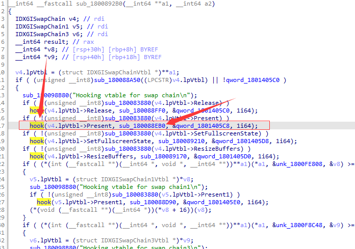

# SteamOverlay

[简体中文](README-zh.md) or [English](README.md)  

- 这个例子通过挂钩GameOverlayRenderer64.dll挂钩过的SwapChain->Present函数达到覆盖叠加层的目的

- 但是他很容易被检测，有很多种方法可以查到（栈回潮、代码检查、截图等等）

- 如果你想要更新特征码，看图下，你可以轻松找到这个代码段

